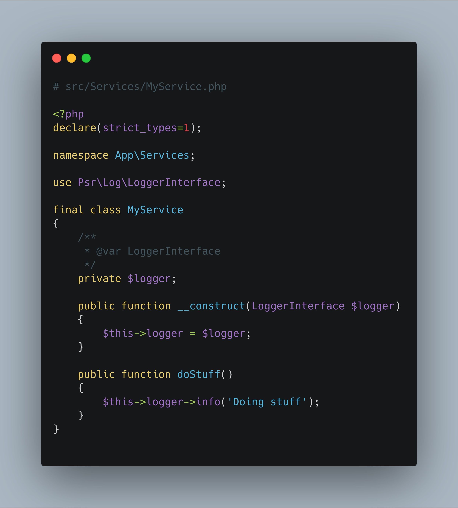
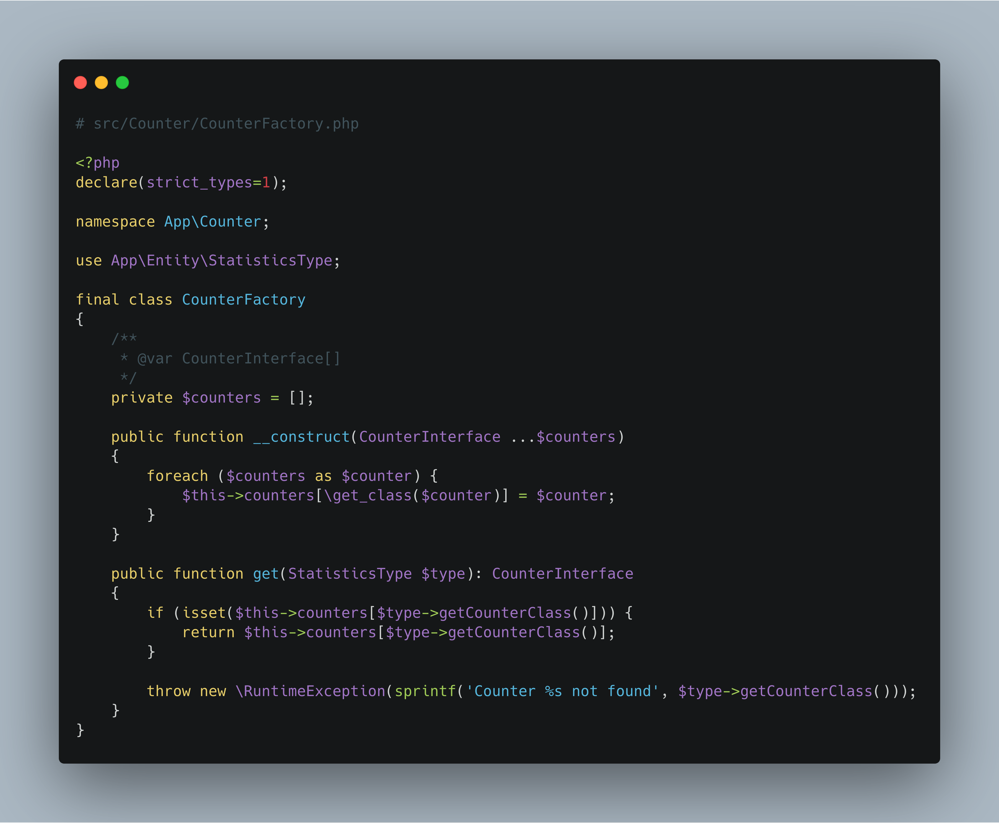
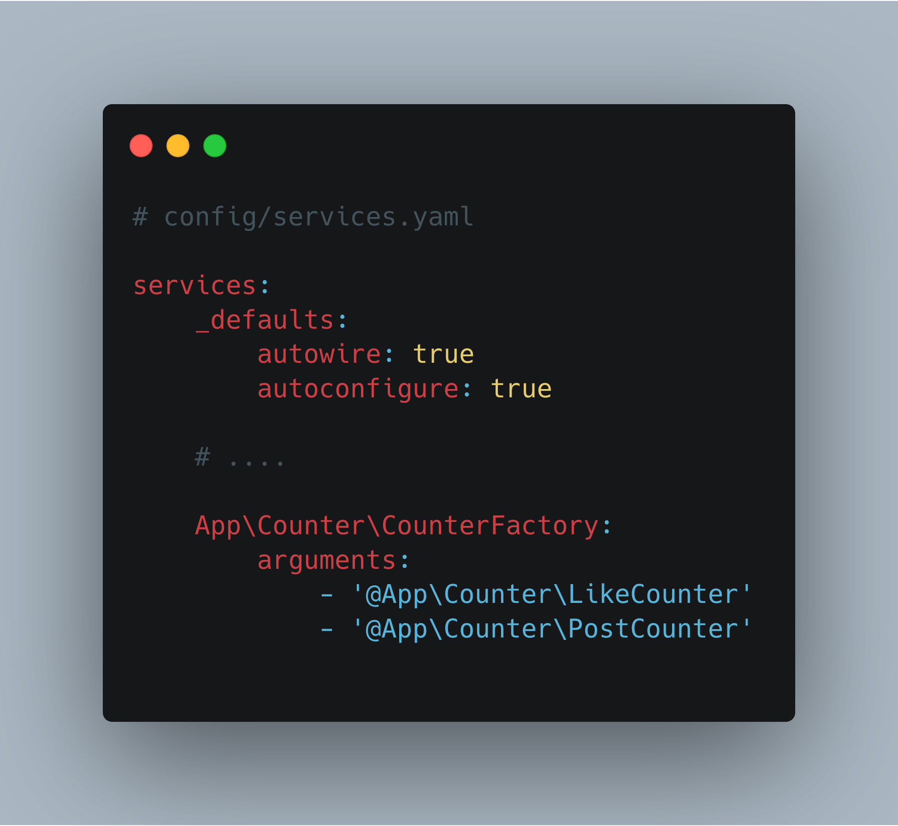
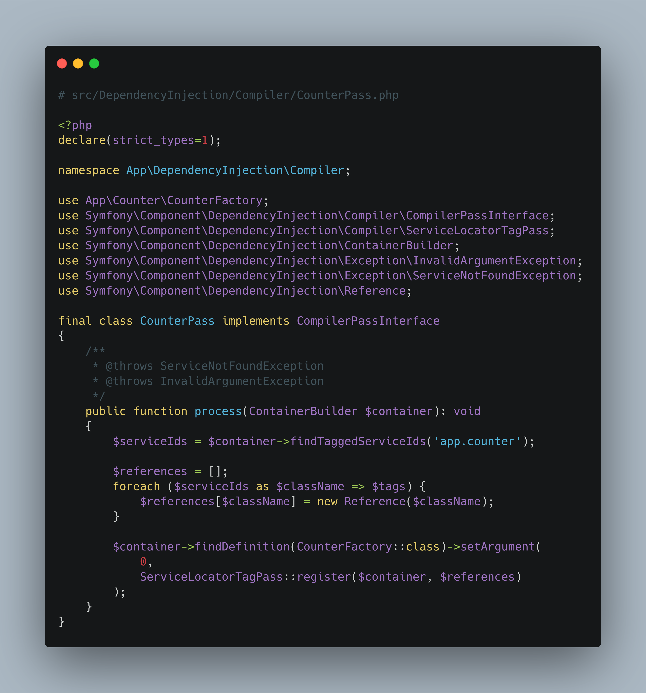
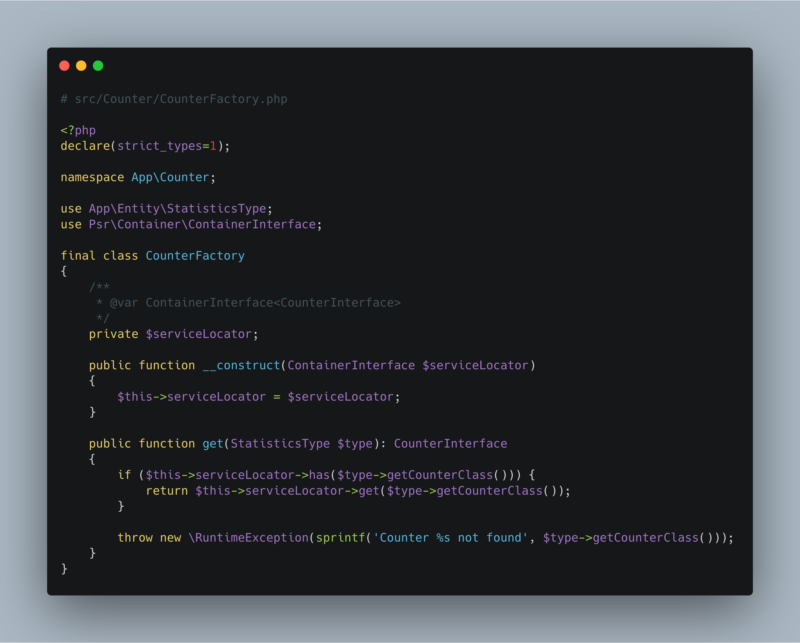
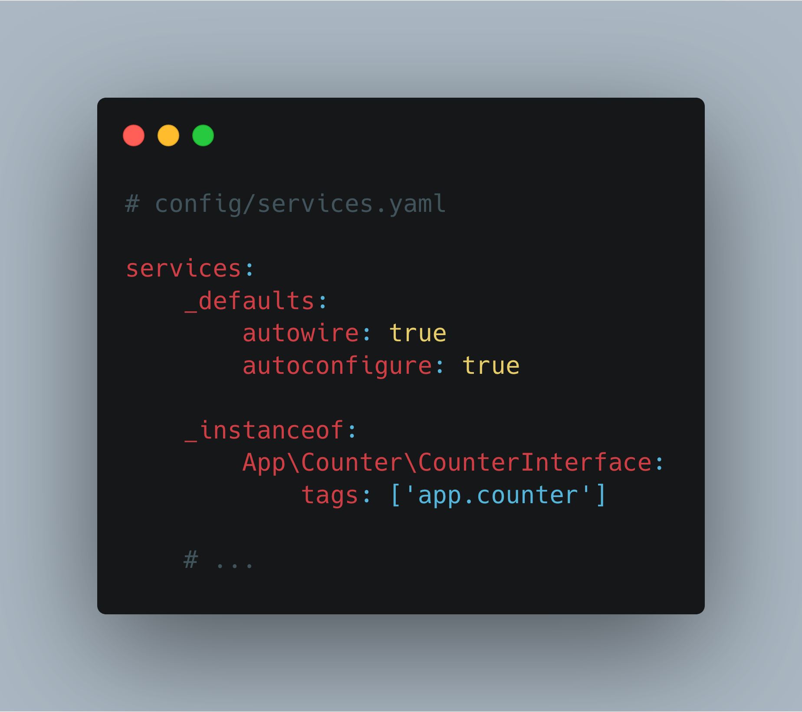
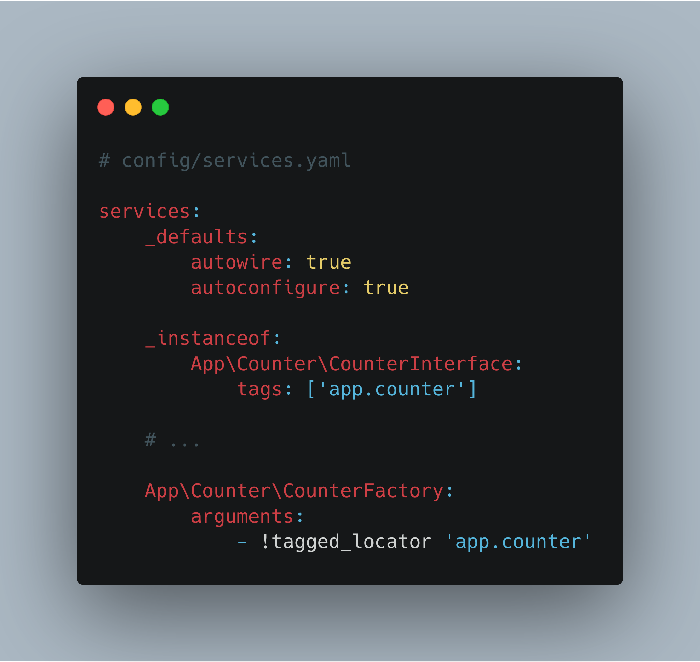
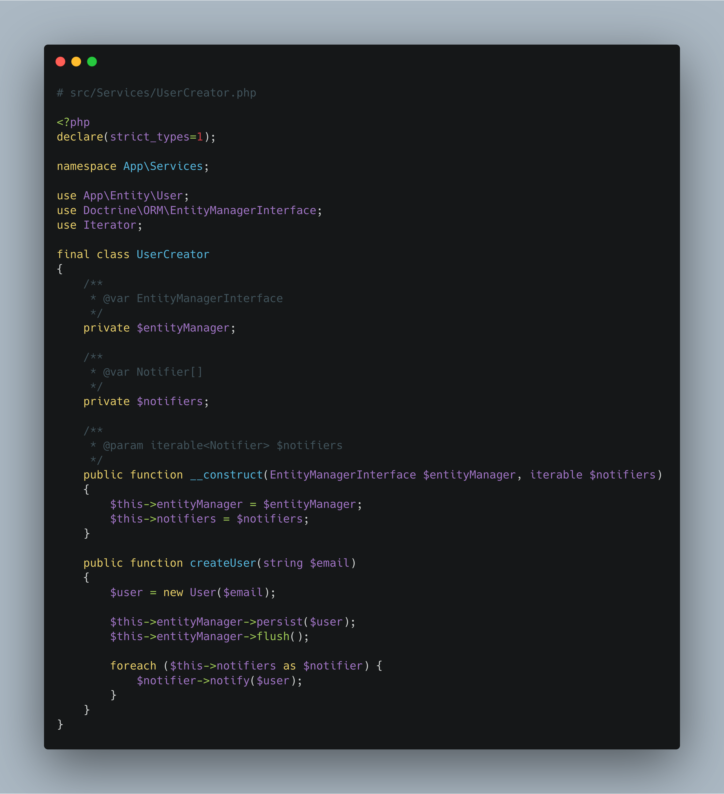
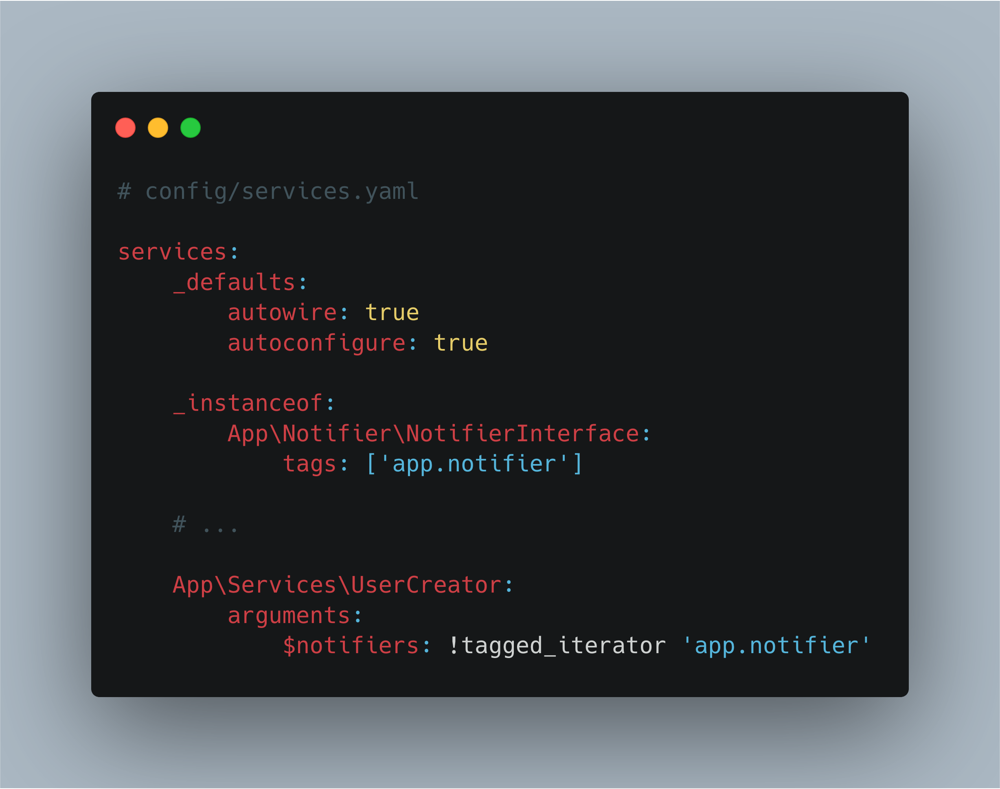

# Talk SymfonyCon

## Dependency Injection
Dependency injection has been a big part of Symfony for a long time. You can
use DI to access services in controllers and to access third party packages
and bundles in our business logic classes.

The Symfony Dependency Injection component supplies a solid basis to make DI
work for you as smoothly as possible. It’s an up-to-date package and new features
are released often.

## Autowiring, the regular way
Since Symfony 3.3, autowiring is turned on by default and it makes the lives
of developers easier by automatically injecting the correct services whenever
possible. In earlier versions of Symfony, you had to manually type out which
services to inject where.

When your service is depending on a typed class, the DI package makes sure
that an instance of that class is injected into your service.
When you are using interfaces with a single implementing class, that class
is also automatically injected into the depending service. Only when an interface
has multiple implementations, you, as a developer, will have to make a choice.

## Factories
Sometimes, a service needs to rely on multiple different implementations of
an interface depending on various situations or variables. When this happens,
a Factory may help out deciding which implementation to choose.

This is an example of a Factory that returns a counting service based on the
given entity (a FQCN is stored in the database).

## Autowiring factories
Configuring factories can be tricky, though. Wiring all possible implementations
manually will cause some work every time a new implementation is added.

In the long run, a more convenient way might be to add all implementations of
an interface automatically. This can be done using a `CompilerPass`.

This `CompilerPass` will alter the service container while compiling it. It
usually only runs during a `cache:clear` command or whenever changes to the
code or configuration are made in dev-mode.

The Factory itself will now use a `ServiceLocator` instance (which is an implementation
of ContainerInterface) to hold the different implementations, instead of using
a plain array.

The compiler pass will need services to be tagged in order to find them. Using
the `_instanceof` option of the service container configuration, you can tag
all implementations of an interface in 1 go.

## New in Symfony 4.4: !tagged_locator
In Symfony 4.4, the creation of a service locator is became easier by the new
`!tagged_locator` configuration option. Using this option will automatically generate
a `ServiceLocator` instance containing all services that are tagged with a
specific tag.

This way, you will no longer have to write your own compiler pass. This will
save time and lets you focus on what's most important: adding more implementations
of your interface.

## Multiple handlers
Say you have again an interface and multiple implementations of that interface,
but this time, you need to use all of them instead of 1 specific one.

In that case, I usually loop through all possibilities and execute them. Manually
wiring these looks a lot like the factory and has the same drawbacks.

This is an example where a service to create a user runs through a list of
notifiers and executes them all.

## Using handlers: !tagged_iterator
The same way as factories, a configuration option `!tagged` was added in Symfony 3.4.
and renamed to `!tagged_iterator` in Symfony 4.4. Using this option, an iterator
containing the different services with the same tag is injected as a dependency,
so you can loop through them.

I hope you are as pleasantly surprised by the improvements in Symfony that makes
our lives as developers easier again and again. I know that in half of my projects,
I can delete quite a chunk of code after upgrading to the latest version of
Symfony. 
