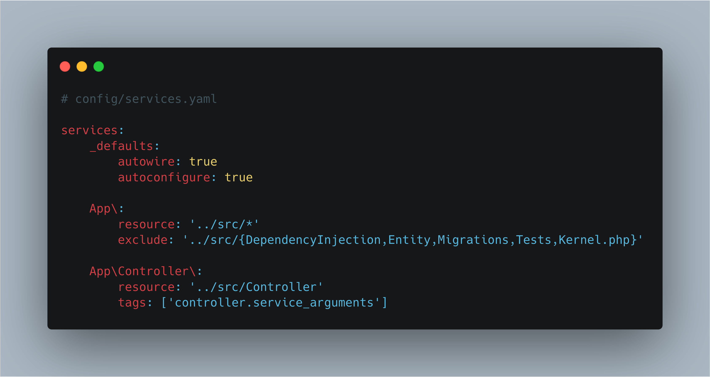

# Talk SymfonyCon

## Take aways from this talk
What Dependency Injection Is
Why you should use dependency injection
How it works in Symfony

## What is Dependecy Injection?
Design pattern, not a framework or library.
Two sides of the problem:
	1 - passing in your dependencies as arguments, be it at the constructor level, the method level or as a field (injection)
	2 - how, where and by whom are said dependencies created

Options: Do it yourself or use libraries/support/frameworks

## Why you should care about and use Dependency Injection
Standard reply: it makes your code testable.
Tacit implication: it forces you to think about what dependencies there are and how best to structure them.
Even if you don't write tests for your code, thinking about your dependencies will lead to better code.

## Dependency Injection in Symfony
Dependency injection has been a big part of Symfony for a long time. From
using services in controllers to depending on(?) packages and bundles in our business
logic classes.

The Symfony Dependency Injection package and bundle supply
a solid base and can make DI work for you as smoothly as possible. It's an up to date package and
new features are released often.

## Autowiring, the regular way
Since Symfony 3.3, autowiring is turned on by default and it makes the lives
of developers easier by automatically injecting the correct services whenever
possible.

Nowadays, even when using interfaces with a single implementing class, this
class is automatically injected into the depending service.

## Factories

Sometimes, a service needs to rely on different implementations of a contract
(interface) depending on various situations or variables. When this happens,
a Factory may help out in deciding which implementation to choose.

## Autowiring factories
Autowiring factories can be tricky, though. Wiring all possible implementations
manually will cause some work every time a new implementation is added.

A more convenient method in the long run might be to tag all possible implementations
and add them automatically, using a `CompilerPass`.

This `CompilerPass` will alter the service container while compiling it. It
usually only runs during a `cache:clear` command or whenever changes to the
code or configuration are made in dev-mode.

The Factory itself will use a `ContainerInterface` to hold the different
implementations, instead of a plain array.

The compiler pass will need services to be tagged in order to find them. Using
the `_instanceof` option of the service container configuration, you can tag
all implementations of an interface in 1 go.

## New in Symfony 4.4: !tagged_locator
In Symfony 4.4, the creation of a service locator is made easier by
adding the `!tagged_locator` configuration option. Using this option will
automatically generate a `ServiceLocator` instance containing all services
that are tagged with a specific tag.

This way, you will no longer have to write your own compiler pass. This will
save you time and lets you focus on what's most important: adding more implementations
of your interface.

## Multiple handlers
Say you have an interface and multiple implementations of that interface,
but this time, you need to use all of them instead of 1 specific one.

Instead of using a single specific implementation, they usually loop through
all possibilities and execute those that are suitable. Manually wiring these
looks a lot like the factory and has the same drawbacks.

## Using handlers: !tagged_iterator
The same way as factories, a configuration option `!tagged` was added in Symfony
3.4. and renamed to `!tagged_iterator` in Symfony 4.4. Using this option, an
iterator containing the different services with the same tag is injected as
a dependency, so you can loop through them.

## Summary
//TODO: one final slide mentioning the different techniques

## Thank you
I hope you are as plesantly surprised by the improvements in Symfony that
make our lives as developers easier again and again. I know that in half
of my projects, I can delete quite a chunk of code after upgrading to the
latest version of Symfony. 
